# End-to-end Hybrid Data Architecture

## Project Description

This project consists on building an end-to-end data project. The data architecture is hybrid, meaning it is partly hosted on cloud services provider AWS and partly locally. It focus on extracting financial data via API services from Alpha Vantage and St. Louis Fed Web Services (FRED API), applying an XGBoost machine learning algorithm to evaluate the price of gold. Data will be stored in AWS S3 and the scripts will be computed in AWS Lambda. The results and curated data will be queried from AWS to Power BI, resulting in an interactive dashboard.

## Procedure
### 1. Extraction
#### 1.1 Get API keys
API keys need to be obtained from Alpha Vantage and FRED websites. They are required in order to make API requests to the respective services.
#### 1.2 Extraction Script
On folder AWS-financial-project/aws_files, there is a file named 'extraction_lambda.py'. This is the python script we will upload to AWS Lambda.
#### 1.3 IAM Permissions - S3 and EventBridge
We need to make sure that our Lambda function is allowed to interact with S3 and EventBridge. S3 is the AWS object storage service where we will store our extracted data in this data staging phase. We will use EventBridge to orchestrate our data pipeline.
Go to IAM, click 'Roles' under 'Access management'.

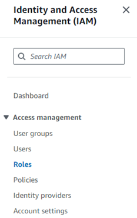

Select "Create Role". Then click on 'AWS Service' as the 'Trusted entity type'.

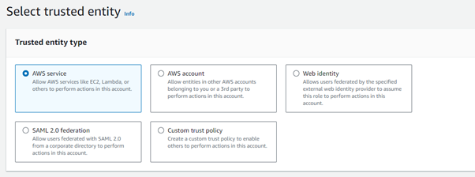

Select that you want to give permissions to Lambda. Then choose 'AmazonS3FullAccess' and 'AmazonEventBridgeFullAccess'

#### 1.4 S3 Bucket and folder for extracted data
Create an S3 bucket and name it as you like. The bucket will be referred to as 'financial-project-1' from now on. The bucket should be in the same region as the Lambda function.
Create a folder in the bucket named 'extraction-staging' that will contain our extracted data.

#### 1.5 Lambda Function for Extraction
Create a Lambda function (select 'Author from scratch'). Name it 'financial-project-1-staging-extraction'. Paste the extraction script on the 'code' tab. Go to the 'Configuration' tab and to 'Environment variables'. Add your API keys as Environment Variables. This shouldn't be done if they were sensitive API keys for security reasons.

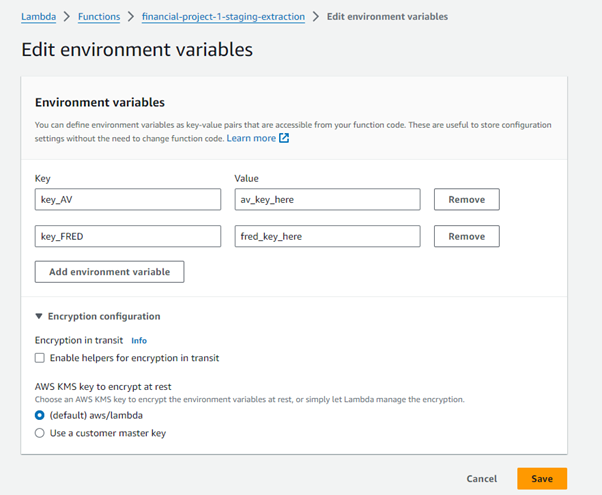

#### 1.6 Upload dependencies
Dependencies are external libraries that we use on our python scripts like numpy or pandas. We need to create a Lambda Layer attached to our Lambda Function and upload a zipped folder to this layer. I did not upload the zipped folder given size restrictions.
Check https://docs.aws.amazon.com/lambda/latest/dg/packaging-layers.html for more info.
You need to go to each libraries' pypi webpage, download the zipped library, then unzip them. You should have a 'mother' folder that contains several folders, each of them corresponding to a specific library. you will then put that 'mother' folder inside some other folders and zip everything. The structure should look like this and make sure to name the folders the same:

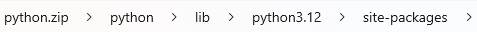

The 'mother' folder mentioned is the 'site-packages' folder, and it should include a folder or two for each package, like this:

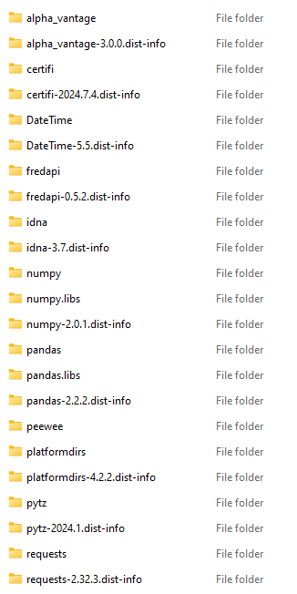

Now create a lambda layer:

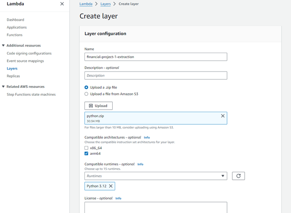

And upload the zipped folder to the layer:

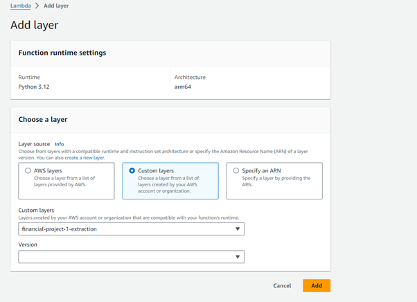

Edit asynchronous configuration options to avoid the function running multiple times 

### 2. Model
#### 2.1 Machine Learning Model Overview
The model script reads the data from the S3 bucket, compiles the data into a single dataframe and uses gold's 30 days exponential moving average along with the other features to evaluate the gold price. The model uses XGBoost, which does not work well when extrapolating. The script uses just gold's 30 day EMA to value gold if we are extrapolating. Future work: instead, build another ML model to apply when extrapolating, resulting in a hybrid model.
The model trains with time series splits and is tested on more recent data. Two grid searches were applied sequentially, first with the main hyperparameters and then adding the regularization parameters. 
Besides implementing the model and storing the results to S3, the script also starts a Glue Crawler to create a data catalog. Power BI will later connect to Athena to query data from this data source.

#### 2.2 S3 folder for model results
In the same bucket, create 2 folders, one named 'complete-dataset' and other named 'model-results'. The former will house the compiled data and the latter the model results on the test set.

#### 2.3 Dependencies - Docker
Since the large size of the XGBoost package, resulting in a total size of over the 250 MB limit, the dependencies of the ML model script and the script itself were ulpoaded as a Docker image. 
Go to Amazon Elastic Container Repository (ECR) service and reate a repository. Let's call it financial-project-1. 
Now create a folder in your computer with the following files:

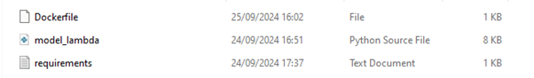

The files are the python script that applies the machine learning model, a text file with the names of the dependencies we need to install and import, and a Dockerfile that builds a docker image, installs the dependencies and containerizes the python script.
You can find the files on this GitHub repository on the directory AWS-financial-project/aws_files.

Now with your ECR repository selected, click 'View push commands'

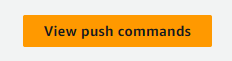

In your local command prompt, go to the directory of the folder containing the 3 files. Copy and run each command from the 'View push commands'. This way you will push the image to ECR.

#### 2.4 IAM Permissions - S3 and Glue
We still need to read and write to S3. We also need the function to start a Glue Crawler - it catalogs our curated data from S3 so we can then use it as a source for Athena to query it to Power BI.
Create a role with 'AmazonS3FullAccess' and 'AWSGlueServiceRole'

#### 2.5 Lambda Function to implement the model
Create a Lambda function from a container image and give it this new IAM role.

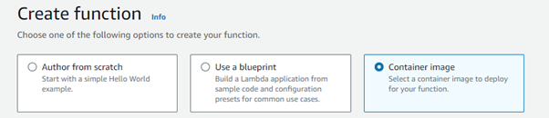

Change the function’s timeout and memory to accommodate for the workload requirements.

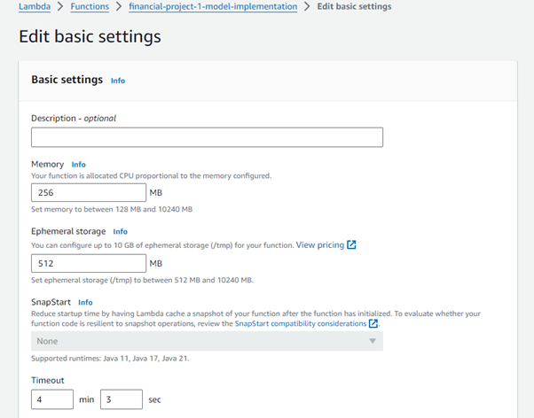

### 3. Orchestration
#### 3.1 Orchestration Overview
The process is orchestrated as following: Every week day the first Lambda function runs on a schedule. Then this function sends an event to EventBridge's event bus that will trigger an EventBridge rule. This EventRule will start the second Lambda Function. This function will start a Glue Crawler that will fetch data from S3 and load it to a database. Then Athena will query this data to Power BI.
#### 3.2 Glue Data Cataloging
The second function starts a Glue Crawler. We need to create that Glue Crawler.
First create a Glue Database. Go to AWS Glue, Databases, Add database.

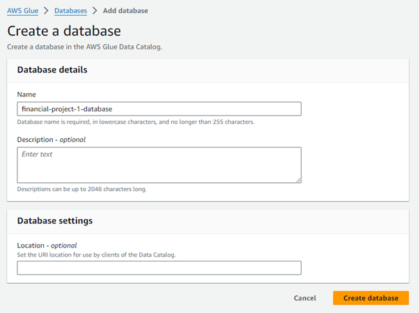

Now go to Crawlers and click 'Add Crawler'. Name it financial-project-1-crawler. Add the folders 'complete_dataset' and 'model_results' as data sources.

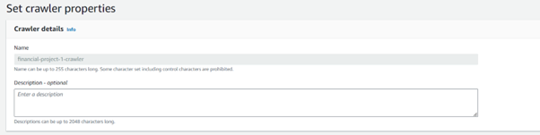

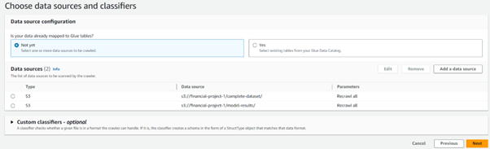

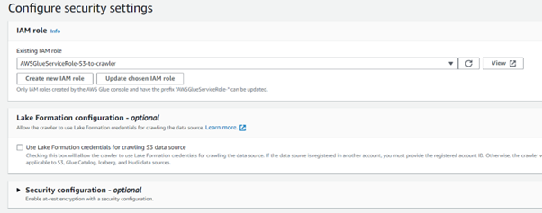

Choose the new database as the target database. This way the crawler will extract the data from S3 to this database.

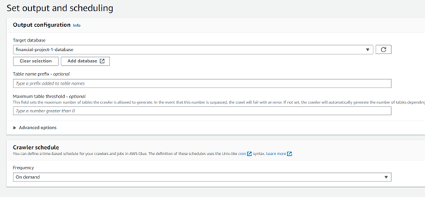

The 2 tables are now in Glue.

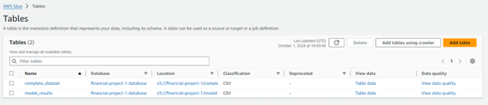

#### 3.3 EventBridge Schedule - Lambda Extraction Function
Go to Amazon Eventbridge and create an EventBridge Schedule:

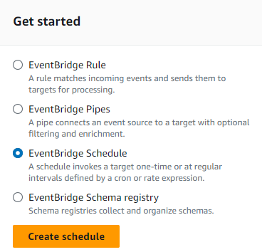
