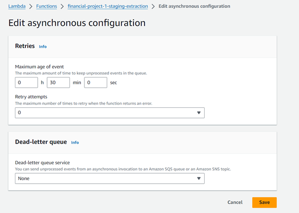

# End-to-end Hybrid Data Architecture

## Project Description

This project consists on building an end-to-end data project. The data architecture is hybrid, meaning it is partly hosted on cloud services provider AWS and partly locally. It focus on extracting financial data via API services from Alpha Vantage and St. Louis Fed Web Services (FRED API), applying an XGBoost machine learning algorithm to evaluate the price of gold. Data will be stored in AWS S3 and the scripts will be computed in AWS Lambda. The results and curated data will be queried from AWS to Power BI, resulting in an interactive dashboard.

## Procedure
### 1. Extraction
#### 1.1 Get API keys
API keys need to be obtained from Alpha Vantage and FRED websites. They are required in order to make API requests to the respective services.
#### 1.2 Extraction Script
On folder AWS-financial-project/aws_files, there is a file named 'extraction_lambda.py'. This is the python script we will upload to AWS Lambda.
#### 1.3 IAM Permissions
We need to make sure that our Lambda function is allowed to interact with S3 and EventBridge. S3 is the AWS object storage service where we will store our extracted data in this data staging phase. We will use EventBridge to orchestrate our data pipeline.
Go to IAM, click 'Roles' under 'Access management'.

Select "Create Role". Then click on 'AWS Service' as the 'Trusted entity type'.

Select that you want to give permissions to Lambda. Then choose “AmazonS3FullAccess” and “AmazonEventBridgeFullAccess”

#### 1.4 S3 Bucket
Create an S3 bucket and name it as you like. The bucket will be referred to as 'financial-project' from now on. The bucket should be in the same region as the Lambda function. Create a folder in the bucket named 'extraction-staging' that will contain our extracted data.

#### 1.5 Lambda Function for Extraction
Create a Lambda function (select 'Author from scratch'). Name it 'financial-project-1-staging-extraction'. Paste the extraction script on the 'code' tab. Go to the 'Configuration' tab and to 'Environment variables'. Add your API keys as Environment Variables. This shouldn't be done if they were sensitive API keys for security reasons.

#### 1.6 Upload dependencies
Dependencies are external libraries that we use on our python scripts like numpy or pandas. We need to create a Lambda Layer attached to our Lambda Function and upload a zipped folder to this layer. I did not upload the zipped folder given size restrictions.
Check https://docs.aws.amazon.com/lambda/latest/dg/packaging-layers.html for more info.
You need to go to each libraries' pypi webpage, download the zipped library, then unzip them. You should have a 'mother' folder that contains several folders, each of them corresponding to a specific library. you will then put that 'mother' folder inside some other folders and zip everything. The structure should look like this and make sure to name the folders the same:

The 'mother' folder mentioned is the 'site-packages' folder, and it should include a folder or two for each package, like this:

Now create a lambda layer:

And upload the zipped folder to the layer:

Edit asynchronous configuration options to avoid the function running multiple times 

## Model
